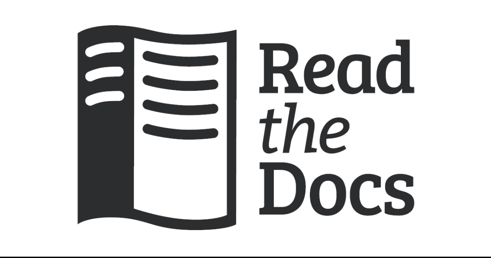

##  Project goals
- Identify and de-identify personal information in images
- Automated data handling processes

## Recommended users
- Medical researchers
- Students working on medical projects
- Hospitals doing medical research

## Lastest News
